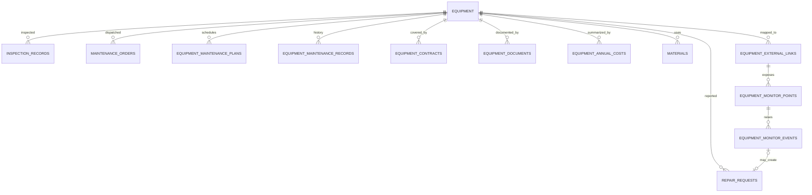

# 設備建置與生命週期系統設計

## 1. 目標與範圍

本設計以「設備唯一識別」為核心，將設備建置、巡檢、預防保養、故障維修、材料備品、文件、合約、成本與中央監控整合成同一份可追溯的設備履歷。來源範本為 `設備履歷管理範本.xlsx`，包含設備總表、保養排程、維修履歷、保養合約、文件管理與年度成本六張工作表。

範本是匯入與交換格式，不直接等同資料庫。六張工作表不得各自保存一份設備名稱；資料庫一律以 `equipment.equipment_id` 關聯，`asset_code` 則作為人員、QR 與外部系統可辨識的設備編號。

## 2. 資料主責與關聯



| 資料 | 主責表 | 重要原則 |
|---|---|---|
| 設備基本資料 | `equipment` | 一機一筆；設備編號不可重複；設備退役只改狀態，不刪除 |
| 巡檢結果 | `inspection_records` | 保留檢查當下的人員、時間、結果；異常可建立報修 |
| 報修與派工 | `repair_requests`、`maintenance_orders` | 保存完整案件狀態歷程，不能覆蓋或刪除歷史 |
| 預防保養 | `equipment_maintenance_plans` | 一台設備可有多個保養項目、週期、清單與觸發條件 |
| 設備履歷 | `equipment_maintenance_records` | 可連回保養計畫與派工單，避免同一工作重複紀錄 |
| 合約 | `equipment_contracts` | 支援同設備多期合約、SLA 與到期預警 |
| 文件 | `equipment_documents` | 檔案放 Storage/文件平台，資料庫保存 URL、版本、校驗碼與有效期 |
| 成本 | `equipment_annual_costs` | Excel 年度彙總可匯入；實際明細仍應由工單與 `cost_records` 產生 |
| 中央監控 | `equipment_external_links`、`equipment_monitor_points` | 以外部設備鍵與點位碼對照，不用設備名稱串接 |

## 3. XLSX 匯入規則

1. 先匯入「設備總表」，以「設備編號」比對 `asset_code`。存在則更新，不存在則新增。
2. 其餘工作表均先用設備編號查找 `equipment_id`；找不到設備時跳過並列入警告，不建立孤兒資料。
3. 「設備名稱」只用於人工核對，不作關聯條件。
4. 日期統一轉成 `YYYY-MM-DD`；金額、年分、功率與停機小時轉成數值。
5. 維修履歷使用匯入鍵避免同一份工作簿重複匯入。
6. 文件欄位只接受 `https://` 或受控 Storage URL；PLC 程式與參數備份應設版本與校驗碼。
7. 匯入前先顯示各工作表筆數與無法匹配的設備編號，經人員確認後才寫入。

系統匯出時會在原有六張工作表之外增加「中央監控介接」工作表，用於交換外部設備鍵、協定、點位碼、位址、單位與告警門檻；原始範本沒有此表時仍可正常匯入。

## 4. 巡檢與保養流程

### 巡檢

設備 QR 應包含穩定的 `asset_code` 或設備頁深連結。掃描後由系統解析成 `equipment_id`，將巡檢結果寫入 `inspection_records`。異常巡檢建立 `repair_requests` 時，必須帶入同一個 `equipment_id`、位置與巡檢紀錄編號。

### 保養

保養計畫應支援：

- 固定日期週期（日、週、月、年）。
- 運轉時數或次數週期。
- 中央監控條件觸發，例如振動、溫度、壓差超限。
- 法定檢查與證照到期。

計畫到期時建立待辦或派工；完成後新增不可覆寫的履歷，更新該計畫的上次完成日與下次到期日。若使用材料或備品，派工單需關聯 `materials`，讓成本與庫存同步。

## 5. 中央監控介接邊界

中央監控、BMS、SCADA 或 IoT 平台通常擁有高頻歷史資料。本系統不應直接保存秒級原始遙測，避免 Supabase 容量、查詢與成本快速失控。

本系統保存：

- 設備與外部系統設備鍵的對照。
- 點位碼、協定、位址、單位、資料型態、正常值與告警門檻。
- 最新值、品質碼、最後收到時間。
- 可稽核的告警/恢復/確認事件。
- 告警事件與報修單的關聯。

高頻歷史值由中央監控或時序資料庫保存。本系統透過 Edge Function/API Gateway 接收事件，不能把 Supabase anon key 當作中央監控的寫入憑證。正式介接必須使用伺服器端密鑰、來源白名單、簽章、重送去重鍵與稽核紀錄。

### 建議事件格式

```json
{
  "schema_version": "1.0",
  "external_system": "BMS-01",
  "external_event_key": "BMS-01-20260713-000001",
  "equipment_key": "EQ-B1-0001",
  "point_code": "MOTOR_TEMP",
  "occurred_at": "2026-07-13T10:00:00+08:00",
  "severity": "warning",
  "state": "open",
  "value": 82.5,
  "unit": "°C",
  "message": "馬達溫度高於警戒值"
}
```

必要控制：`schema_version`、唯一 `external_event_key`、ISO 8601 含時區時間、設備與點位白名單、重複事件冪等處理、失敗重送與死信佇列。

## 6. 資料治理與風險控制

- 設備編號一經使用不可重新分配；設備更換應建立新設備並以履歷紀錄替換關係。
- 位置名稱可能改動，關聯使用 `location_id`，同時保留當時文字快照供稽核。
- 所有日期使用西元 `YYYY-MM-DD`；事件時間使用含時區的 `timestamptz`。
- 退役設備、過期合約與舊文件只改 `status`/`is_current`，不實體刪除。
- 中央監控的寫入權限與一般瀏覽器權限分離；正式環境必須收斂 RLS。
- PLC 程式與參數備份需保存版本、校驗碼、上傳者與有效日期，避免錯版回復。
- 成本需區分維修費、保養費、零件費與停機損失，幣別及稅額則應在第二階段補強。

## 7. 導入順序

1. 執行 `system/sql/equipment_lifecycle.sql`。
2. 先匯入設備總表並修正重複/缺少的設備編號。
3. 匯入保養、維修、合約、文件與年度成本資料。
4. 讓巡檢 QR、報修與派工全部改用同一 `equipment_id`。
5. 建立點位清冊與外部設備鍵，再進行中央監控測試介接。
6. 完成資料對帳、權限矩陣、備援與稽核演練後才正式上線。
